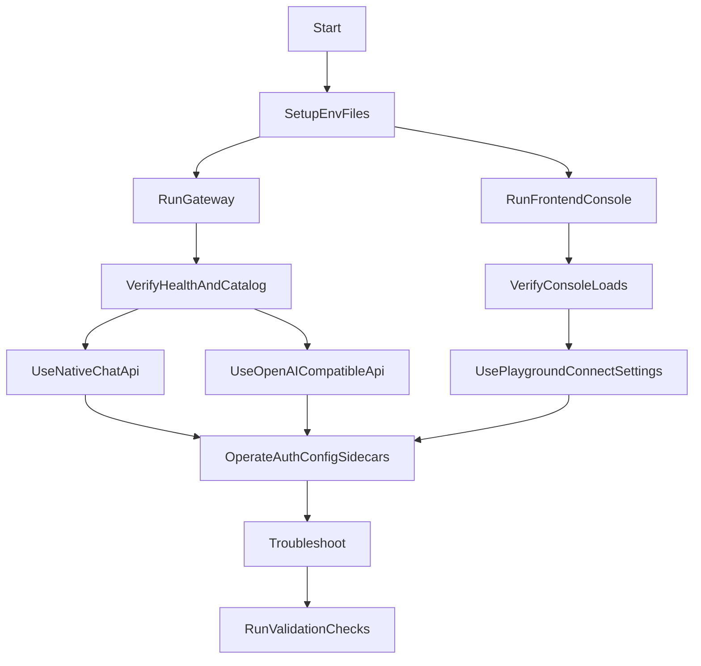

# ReaLMM Usage Walkthrough

This guide is about using the repo in practice (backend + frontend), not its internal architecture.

It assumes you want to:
- run the gateway and console locally,
- make real API calls (native and OpenAI-compatible),
- operate auth/runtime toggles safely,
- troubleshoot common failures quickly.

## 1) Who This Is For

### Operator (console user)
- Goal: run `web` console, chat, inspect health/status, toggle runtime layers, manage inbound keys.
- Main surfaces: `Playground`, `Connect`, `Settings`.

### API Integrator (backend consumer)
- Goal: call `POST /chat`, `POST /v1/chat/completions`, or `POST /v1/embeddings` reliably.
- Main surfaces: `/docs`, `curl`, Python/OpenAI SDK.

### Infra/DevOps
- Goal: run with Redis, enforce readiness/reliability knobs, expose metrics safely.
- Main surfaces: `.env`, `compose.yaml`, `/healthz`, `/health`, `/ready`, `/metrics`.

### Contributor
- Goal: verify behavior and safely extend user-facing functionality.
- Main surfaces: backend/frontend tests and route/hook files.

## 2) Usage Flow



## 3) Fastest Start (Host Venv)

### 3.1 Prepare env files

Short path from the repo root (chat only, memory, or full stack):

```bash
cp env/groq.env .env
# or: env/ollama.env  env/memory.env  env/full.env
```

[`.env.example`](.env.example) is the full knob list if you need every flag.

Fill at least one provider key (`GROQ_API_KEY`, `OPENAI_API_KEY`, or dummy `OLLAMA_API_KEY` plus a pulled model). Presets and the example set `GATEWAY_ALLOW_OPEN=1` for the loopback-only command below. Do not keep that on a reachable bind.

Settings overlay (`data/runtime-flags.json`) can keep MEMORY / PII / GUARD on after `.env` says `0`. Turn layers off in Settings, not only in `.env`.

Optional but common:
- `GATEWAY_API_KEY=...` to require inbound auth and enable Settings toggles,
- `REDIS_URL=redis://localhost:6379/0` for shared cache/RPM/budget (host uvicorn does not use Redis unless this is set),
- `OBS_METRICS=1` if you want `/metrics`.

### 3.2 Run backend

```bash
uv pip install -r requirements.txt
.venv/bin/python -m uvicorn app.main:app --host 127.0.0.1 --port 8000
```

### 3.3 Run frontend

```bash
cd web
cp .env.local.example .env.local
npm install
npm run dev
```

Default URLs:
- Console: `http://localhost:3000`
- Gateway: `http://127.0.0.1:8000`
- API docs: `http://127.0.0.1:8000/docs`

## 4) Fastest Start (Docker Compose)

Use this when you want Redis + isolated container runtime. From the repo root:

```bash
cp .env.example .env
docker compose up --build
```

Notes:
- Set independent, random `GATEWAY_API_KEY` and `GATEWAY_KEY_PEPPER` values before starting. Compose forces `GATEWAY_ALLOW_OPEN=0` and refuses to start without both.
- Gateway is still reached at `http://127.0.0.1:8000` from browser.
- Compose sets gateway Redis to `redis://redis:6379/0`.
- First memory/PII requests may download models into `./data`.

## 5) First Successful Backend Calls

If auth is enabled, add:
- `-H "Authorization: Bearer $GATEWAY_API_KEY"`

### 5.1 Health and catalog

```bash
curl -s http://127.0.0.1:8000/healthz
curl -s http://127.0.0.1:8000/health | python -m json.tool
curl -s http://127.0.0.1:8000/models | python -m json.tool
curl -s http://127.0.0.1:8000/prompts | python -m json.tool
curl -s http://127.0.0.1:8000/config | python -m json.tool
```

`GET /healthz` is public liveness. `/health` and `/ready` stay behind the `read` scope when auth is on.

### 5.2 Native chat (`/chat`)

```bash
curl -s http://127.0.0.1:8000/chat \
  -H "Content-Type: application/json" \
  -d '{"model":"<catalog-model-id>","messages":[{"role":"user","content":"hello"}]}'
```

Structured output is per-request `response_format` on `POST /chat` (not an env flag, not the console). Do not combine it with `stream: true`.

Stream mode:

```bash
curl -N http://127.0.0.1:8000/chat \
  -H "Content-Type: application/json" \
  -d '{"model":"<catalog-model-id>","messages":[{"role":"user","content":"hello"}],"stream":true}'
```

### 5.3 OpenAI-compatible (`/v1`)

```bash
curl -s http://127.0.0.1:8000/v1/models | python -m json.tool
```

```bash
curl -s http://127.0.0.1:8000/v1/chat/completions \
  -H "Content-Type: application/json" \
  -d '{"model":"<catalog-model-id>","messages":[{"role":"user","content":"hello"}],"temperature":0.2,"max_tokens":64,"user_id":"agent-42"}'
```

```bash
curl -s http://127.0.0.1:8000/v1/embeddings \
  -H "Content-Type: application/json" \
  -d '{"model":"<catalog-model-id>","input":["hello"]}'
```

## 6) Frontend Usage Playbook

### 6.1 Playground (chat)
- Open `http://localhost:3000`.
- Choose a model from the sidebar `Model` select.
- Optionally select a prompt from `Prompt`.
- Send a user message.
- Use `New chat` to rotate conversation context.

The sidebar Sidecars row includes a ready lamp and Redis mode from `GET /ready`.

Expected behavior:
- if request succeeds, assistant response appears with meta (tokens/cost/cache/fallback if present),
- if unauthorized, UI prompts for gateway key,
- if stream error occurs, assistant bubble turns into an error row.

### 6.2 Connect (integration snippets)
- Open `/connect`.
- Copy one of:
  - curl snippet,
  - Python snippet,
  - OpenAI SDK snippet.
- Snippets target your configured gateway URL.

### 6.3 Settings (runtime layer toggles and keys)
- Open `/settings`.
- Paste gateway key if required.
- Toggle:
  - `MEMORY`
  - `PII`
  - `GUARD`
  - `GUARD_INJECTION`
  - `GUARD_CONTENT`
- When the pasted key has `admin`, the Gateway keys panel lists keys, creates a new one (secret shown once), and revokes active keys.

Important:
- These toggles update `data/runtime-flags.json`.
- They do **not** rewrite `.env`.
- Restart is still required for static settings (`restart_for` hints are shown in UI).

## 7) Auth, Scopes, and Key Usage

Gateway auth can be off or on:
- **off**: only when `GATEWAY_ALLOW_OPEN=1`; keep the process bound to loopback,
- **on**: supply either
  - `Authorization: Bearer <key>`, or
  - `X-Api-Key: <key>`.

Scope model:
- `read`: health/models/prompts/budget/ready/metrics,
- `chat`: chat, embeddings, memory write/delete; also `/v1/models` and `GET /memory`,
- `config`: config patch,
- `admin`: key management endpoints.

`GET /config` needs a valid key when auth is on, but no extra scope.

Admin identities can also carry quotas. Chat admission enforces them:
- `daily_token_budget` (402)
- `daily_usd_budget` (402)
- `rpm` (429)

Admin key lifecycle endpoints:
- `GET /admin/keys`
- `POST /admin/keys`
- `PATCH /admin/keys/{key_id}`
- `DELETE /admin/keys/{key_id}`

## 8) Runtime Operations (Backend + Frontend)

### 8.1 Runtime flags vs restart settings
- Runtime flags (`/config` patch): memory/pii/guard layers.
- Restart-required settings (`.env`): provider keys, Redis URL, budgets, embedder, many reliability knobs.

### 8.2 Sidecar enablement basics
See [memory](docs/memory.md), [guardrails](docs/guardrails.md), and [PII](docs/pii.md).
- Memory:
  - set `MEMORY=1` and a catalog chat id for extract (`MEMORY_LLM_MODEL` may match the chat model; do not point Mem0 at this gateway's `POST /chat`; avoid reasoning ids),
  - embeddings default to local FastEmbed `BAAI/bge-small-en-v1.5` (first request downloads ONNX into `./data`). Groq has no embeddings API,
  - `MEMORY_EMBEDDER=openai` needs `OPENAI_API_KEY` and a fresh `data/mem0` if you switch.
- PII:
  - set `PII=1` and `pip install -r requirements-pii.txt`,
  - optional `PII_ENTITIES`, `PII_SPACY_MODEL`. First request may download spaCy into `./data`.
- Guardrails:
  - `GUARD=1` is only the switch. `GUARD_INJECTION` and `GUARD_CONTENT` default on,
  - two extra models, not the chat model: `groq/meta-llama/llama-prompt-guard-2-22m` and `groq/meta-llama/llama-guard-4-12b`,
  - drop-in is `GROQ_API_KEY`; those ids must appear in `GET /models` or chat is `503`. Other providers need exact catalog ids on `GUARD_*_MODEL`.

### 8.3 Budget, rate, reliability
- Process caps: `MAX_INPUT_TOKENS`, `MAX_OUTPUT_TOKENS`, `DAILY_TOKEN_BUDGET`, `DAILY_USD_BUDGET`.
- Per-key quotas on `/admin/keys` are enforced on chat (token/USD 402, RPM 429), not only stored.
- Reliability: `LITELLM_NUM_RETRIES`, `LITELLM_CACHE`, `LITELLM_CACHE_TTL`, `FALLBACKS`.
- Host uvicorn does not use Redis unless `REDIS_URL` is set. Cache, RPM/TPM, and daily budget then stay per-process (`data/budget-state.json`).
- Multi-worker or Compose: set `REDIS_URL` (Compose uses `redis://redis:6379/0`).
- Readiness:
  - `/healthz` is public liveness,
  - `/health` gives broad status (may show degraded),
  - `/ready` is the strict gate (503 when not ready).

## 9) Troubleshooting Matrix (Backend + Frontend)

- `401 gateway_unauthorized` -> missing/invalid gateway key -> set/paste `GATEWAY_API_KEY`, send Bearer or `X-Api-Key`.
- `403 gateway_key_required` on `/config` patch -> config patch requires configured gateway auth -> set `GATEWAY_API_KEY` in `.env`, restart.
- `403 forbidden` with `required_scope` -> key lacks scope -> use/create key with needed scope (`read`, `chat`, `config`, or `admin`).
- `400` unknown model -> requested id not in catalog -> call `GET /models` and use exact returned id.
- `402` budget exceeded -> process daily cap or per-key quota tripped -> raise caps or reduce load.
- `429` rate limited -> provider limit or identity RPM cap -> reduce request rate or raise limits.
- `503` guard/memory/pii errors -> sidecar enabled but missing dependency/model config -> verify sidecar env settings.
- `/ready` returns `503` -> provider unavailable or Redis readiness failure -> restore provider access and/or Redis reachability.
- Frontend "Could not reach gateway" -> backend down or wrong `NEXT_PUBLIC_GATEWAY_URL` -> start backend and fix `web/.env.local`.
- Settings toggles disabled -> missing key or missing `config/admin` scope -> paste correct key and ensure required scope.
- `stream: true` with `response_format` fails -> unsupported combination -> use non-stream structured output requests.

## 10) Validation Checklist

### Backend checks

```bash
uv pip install -r requirements-dev.txt
PYTEST_DISABLE_PLUGIN_AUTOLOAD=1 .venv/bin/python -m pytest -q tests/test_main.py tests/test_openai_compat.py tests/test_auth.py tests/test_scopes.py tests/test_budget.py tests/test_identity_budget.py tests/test_identity_rpm.py tests/test_reliability.py tests/test_ready.py tests/test_observability.py
```

### Frontend checks

```bash
cd web
npm run typecheck
npm test
npm run test:coverage
npm run build
```

### Minimal smoke probes
- `GET /healthz`, `/health`, `/ready`, `/models`, `/config`, `/budget`
- `POST /chat` (json + stream)
- `POST /v1/chat/completions`
- `POST /v1/embeddings`
- `/settings` toggle and key-panel behavior with and without proper key/scope.

## 11) If You Want To Change Usage Behavior

- API route behavior:
  - `app/api/routes/chat.py`
  - `app/api/routes/openai.py`
  - `app/api/routes/meta.py`
  - `app/api/routes/config.py`
  - `app/api/routes/admin.py`
- Auth and scope checks:
  - `app/api/auth.py`
  - `app/infrastructure/identities.py`
- Runtime budgets/reliability:
  - `app/infrastructure/budget.py`
  - `app/infrastructure/router.py`
  - `app/infrastructure/redis_health.py`
- Frontend operator UX:
  - `web/components/ConsoleShell.tsx`
  - `web/components/SettingsView.tsx`
  - `web/components/AdminKeysPanel.tsx`
  - `web/components/ConnectView.tsx`
  - `web/hooks/useGatewayCatalog.ts`
  - `web/hooks/useRuntimeConfig.ts`
  - `web/hooks/useChatSession.ts`

