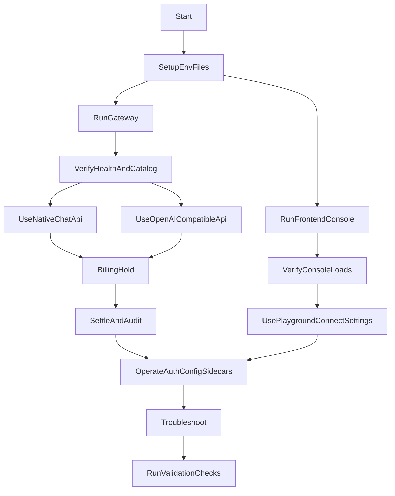

# ReaLMM Usage Walkthrough

This guide is about using the repo in practice (backend + frontend), not its internal architecture.

It assumes you want to:
- run the gateway and console locally,
- make real API calls (native and OpenAI-compatible),
- operate auth/runtime toggles safely,
- inspect prepaid balance, feature spend, and denials,
- troubleshoot common failures quickly.

## 1) Who This Is For

### Operator (console user)
- Goal: run `web` console, chat, inspect health/status and prepaid balance, toggle runtime layers, manage inbound keys.
- Main surfaces: `Playground`, `Connect`, `Settings`, and the billing rail.

### API Integrator (backend consumer)
- Goal: call `POST /chat`, `POST /v1/chat/completions`, or `POST /v1/embeddings` reliably.
- Main surfaces: `/docs`, `curl`, Python/OpenAI SDK.

### Infra/DevOps
- Goal: run with Redis, enforce readiness/reliability knobs, expose metrics safely.
- Main surfaces: `.env`, `compose.yaml`, `/healthz`, `/health`, `/ready`, `/metrics`.

### Contributor
- Goal: verify behavior and safely extend user-facing functionality.
- Main surfaces: backend/frontend tests and route/hook files.

## 2) Usage Flow


```mermaid
flowchart TD
  start[Start]
  start --> setup[SetupEnvFiles]
  setup --> runGateway[RunGateway]
  setup --> runFrontend[RunFrontendConsole]
  runGateway --> verifyApi[VerifyHealthAndCatalog]
  runFrontend --> verifyUi[VerifyConsoleLoads]
  verifyApi --> nativeUse[UseNativeChatApi]
  verifyApi --> openaiUse[UseOpenAICompatibleApi]
  verifyUi --> uiPlaybook[UsePlaygroundConnectSettings]
  nativeUse --> hold[BillingHold]
  openaiUse --> hold
  hold --> settle[SettleAndAudit]
  settle --> ops[OperateAuthConfigSidecars]
  uiPlaybook --> ops
  ops --> troubleshoot[Troubleshoot]
  troubleshoot --> validate[RunValidationChecks]
```

## 3) Fastest Start (Host Venv)

Install and start from [README](README.md).

Preset files under [`env/`](env/): `groq.env`, `ollama.env`, `memory.env`, `full.env`, `nvidia.env`. Each sets `REALMM_CONFIG` to the matching file under [`config/`](config/). [`.env.example`](.env.example) is keys and deployment wiring. [`config/realmm.yaml`](config/realmm.yaml) is the policy file.

Fill at least one provider key (`GROQ_API_KEY`, `OPENAI_API_KEY`, or dummy `OLLAMA_API_KEY` plus a pulled model). Presets and the example set `GATEWAY_ALLOW_OPEN=1` for the loopback-only host command. Do not keep that on a reachable bind.

Settings overlay (`data/runtime-flags.json`) can keep MEMORY / PII / GUARD on after the policy file says off. Turn layers off in Settings, not only in `config/realmm.yaml`.

Optional but common:
- `GATEWAY_API_KEY=...` to require inbound auth and enable Settings toggles,
- `REDIS_URL=redis://localhost:6379/0` for shared cache/RPM/budget (host uvicorn does not use Redis unless this is set),
- `OBS_METRICS=1` if you want `/metrics`.

Default URLs:
- Console: `http://localhost:3000`
- Gateway: `http://127.0.0.1:8000`
- API docs: `http://127.0.0.1:8000/docs`

## 4) Fastest Start (Docker Compose)

Install and start from [README](README.md). Use Compose when you want Redis and an isolated container runtime.

Notes:
- Set independent, random `GATEWAY_API_KEY` and `GATEWAY_KEY_PEPPER` values before starting. Compose forces `GATEWAY_ALLOW_OPEN=0` and refuses to start without both. `GATEWAY_KEY_PEPPER` is also required when any issued key exists, and before a new key is hashed, including `GATEWAY_ALLOW_OPEN=1`. Open mode with an empty key file may still serve the legacy gateway key.
- Gateway is still reached at `http://127.0.0.1:8000` from the browser.
- Compose sets gateway Redis to `redis://redis:6379/0`.
- First memory/PII requests may download models into `./data`.

## 5) First Successful Backend Calls

If auth is enabled, add:
- `-H "Authorization: Bearer $GATEWAY_API_KEY"`

### 5.1 Health and catalog

```bash
curl -s http://127.0.0.1:8000/healthz
curl -s http://127.0.0.1:8000/health | python -m json.tool
curl -s http://127.0.0.1:8000/models | python -m json.tool
curl -s http://127.0.0.1:8000/prompts | python -m json.tool
curl -s http://127.0.0.1:8000/config | python -m json.tool
```

`GET /healthz` is public liveness. `/health` and `/ready` stay behind the `read` scope when auth is on.

### 5.2 Native chat (`/chat`)

```bash
curl -s http://127.0.0.1:8000/chat \
  -H "Content-Type: application/json" \
  -d '{"model":"<catalog-model-id>","messages":[{"role":"user","content":"hello"}]}'
```

Structured output is per-request `response_format` on `POST /chat` (not an env flag, not the console). Do not combine it with `stream: true`.

Stream mode:

```bash
curl -N http://127.0.0.1:8000/chat \
  -H "Content-Type: application/json" \
  -d '{"model":"<catalog-model-id>","messages":[{"role":"user","content":"hello"}],"stream":true}'
```

### 5.3 OpenAI-compatible (`/v1`)

```bash
curl -s http://127.0.0.1:8000/v1/models | python -m json.tool
```

```bash
curl -s http://127.0.0.1:8000/v1/chat/completions \
  -H "Content-Type: application/json" \
  -d '{"model":"<catalog-model-id>","messages":[{"role":"user","content":"hello"}],"temperature":0.2,"max_tokens":64,"user_id":"agent-42"}'
```

`user_id` (and OpenAI `user`) is trace metadata (`trace_user_id`) only. It does not select the Mem0 tenant.

```bash
curl -s http://127.0.0.1:8000/v1/embeddings \
  -H "Content-Type: application/json" \
  -d '{"model":"<catalog-model-id>","input":["hello"]}'
```

### 5.4 Billing status, usage, and policy

`GET /billing/status` is also in the README check. Status and usage need `read`. Reconcile and team policy need `admin`.

```bash
curl -s "http://127.0.0.1:8000/billing/usage?offset=0&limit=25" \
  -H "Authorization: Bearer ${GATEWAY_API_KEY}"
curl -s http://127.0.0.1:8000/billing/teams/team-a \
  -H "Authorization: Bearer ${GATEWAY_API_KEY}"
curl -s -X PATCH http://127.0.0.1:8000/billing/teams/team-a \
  -H "Authorization: Bearer ${GATEWAY_API_KEY}" \
  -H "Content-Type: application/json" \
  -d '{"team_id":"team-a","daily_usd_cap":25,"prepaid_balance_usdc":10}'
curl -s -X POST http://127.0.0.1:8000/billing/reconcile \
  -H "Authorization: Bearer ${GATEWAY_API_KEY}"
```

`GET /health` and `GET /budget` include `line_item_totals`. `GET /config` includes billing mode, cache billable, and the unpriced-model policy. Usage is paginated with `offset` and `limit`.

In `wallet` mode, reconcile returns `mode` `arc` when the RPC read succeeds. A later Arc sync overwrites the funded team's balance from the chain. Other teams stay on the file ledger. A team-policy patch can set another team's prepaid balance. It does not stick for the funded team after the next chain read.

## 6) Frontend Usage Playbook

### 6.1 Playground (chat)
- Open `http://localhost:3000`.
- Choose a model from the sidebar `Model` select.
- Optionally select a prompt from `Prompt`.
- Send a user message.
- Use `New chat` to mint a new `conversation_id`. Long-term facts stay on the authenticated key. A new conversation does not partition them.

The right rail shows billing mode, prepaid balance, the Arc deposit address, the Circle faucet link, daily burn, the feature split, the top cost driver, and recent usage. The Sidecars row includes a ready lamp and Redis mode from `GET /ready`.

Expected behavior:
- if request succeeds, assistant response appears with meta (tokens/cost/cache/fallback if present),
- if unauthorized, UI prompts for gateway key,
- if stream error occurs, assistant bubble turns into an error row.

### 6.2 Connect (integration snippets)
- Open `/connect`.
- Copy one of:
  - curl snippet,
  - Python snippet,
  - OpenAI SDK snippet.
- Snippets target your configured gateway URL.

### 6.3 Settings (runtime layer toggles and keys)
- Open `/settings`.
- Paste gateway key if required.
- Toggle:
  - `MEMORY`
  - `PII`
  - `GUARD`
  - `GUARD_INJECTION`
  - `GUARD_CONTENT`
- When the pasted key has `admin`, the Gateway keys panel lists keys, creates a new one (secret shown once), and revokes active keys. Settings also shows billing mode hints and **Reconcile billing**.

Important:
- These toggles update `data/runtime-flags.json`.
- They do **not** rewrite `.env`.
- Restart is still required for static settings (`restart_for` hints are shown in UI).

## 7) Auth, Scopes, and Key Usage

Gateway auth can be off or on:
- **off**: only when `GATEWAY_ALLOW_OPEN=1`; keep the process bound to loopback,
- **on**: supply either
  - `Authorization: Bearer <key>`, or
  - `X-Api-Key: <key>`.

Scope model:
- `read`: health/models/prompts/budget/ready/metrics,
- `chat`: chat, embeddings, memory write/delete; also `/v1/models` and `GET /memory`,
- `config`: config patch,
- `admin`: key management endpoints.

`GET /config` needs a valid key when auth is on, but no extra scope.

Admin identities can also carry quotas. Chat admission enforces them:
- `daily_token_budget` (402)
- `daily_usd_budget` (402)
- `rpm` (429)

Admin key lifecycle endpoints:
- `GET /admin/keys`
- `POST /admin/keys`
- `PATCH /admin/keys/{key_id}`
- `DELETE /admin/keys/{key_id}`

## 8) Runtime Operations (Backend + Frontend)

### 8.1 Runtime flags vs restart settings
- Runtime flags (`/config` patch): memory/pii/guard layers.
- Restart-required settings (`.env` for keys and deployment, `config/realmm.yaml` for policy): provider keys, Redis URL, budgets, embedder, many reliability knobs.

### 8.2 Sidecar enablement basics
- Memory:
  - set `memory.enabled` in `config/realmm.yaml` (or `MEMORY=1`) and a catalog chat id for extract (`memory.llm_model` / `MEMORY_LLM_MODEL` may match the chat model; do not point Mem0 at this gateway's `POST /chat`; avoid reasoning ids),
  - the Mem0 `user_id` is the authenticated key (`default` for `GATEWAY_API_KEY`). `GET` and `POST /memory` ignore a client `user_id`. `DELETE /memory/{id}` returns 404 unless that id belongs to the caller. Facts stored under `local` do not appear under a real key. Chat fact search ignores `conversation_id`,
  - embeddings default to local FastEmbed `BAAI/bge-small-en-v1.5` (first request downloads ONNX into `./data`). Groq has no embeddings API,
  - `MEMORY_EMBEDDER=openai` needs `OPENAI_API_KEY` and a fresh `data/mem0` if you switch. Extractor tokens count on the same key as the chat.
- PII:
  - set `PII=1` and `pip install -r requirements-pii.txt`,
  - optional `PII_ENTITIES`, `PII_SPACY_MODEL`. First request may download spaCy into `./data`,
  - with PII on, a streamed reply is buffered and redacted once at the end. The first token waits for the full reply.
- Guardrails:
  - `GUARD=1` is only the switch. `GUARD_INJECTION` and `GUARD_CONTENT` default on,
  - two extra models, not the chat model: `groq/meta-llama/llama-prompt-guard-2-22m` and `groq/meta-llama/llama-guard-4-12b`,
  - drop-in is `GROQ_API_KEY`; those ids must appear in `GET /models` or chat is `503`. Other providers need exact catalog ids on `GUARD_*_MODEL`.

### 8.3 Budget, rate, reliability
- Process caps: `MAX_INPUT_TOKENS`, `MAX_OUTPUT_TOKENS`, `DAILY_TOKEN_BUDGET`, `DAILY_USD_BUDGET`.
- Per-key quotas on `/admin/keys` are enforced on chat (token/USD 402, RPM 429), not only stored. Guard and memory-extractor tokens count on the same key.
- The chat estimate is reserved before the provider call, released if the call fails, and replaced by the actual token count on success. A crash between reserve and release can hold that estimate until the UTC day rolls.
- Reliability: `LITELLM_NUM_RETRIES`, `LITELLM_CACHE`, `LITELLM_CACHE_TTL`, `FALLBACKS`.
- Host uvicorn does not use Redis unless `REDIS_URL` is set. Cache, RPM/TPM, and daily budget then stay per-process (`data/budget-state.json`).
- `WEB_CONCURRENCY` or `UVICORN_WORKERS` greater than 1 without `REDIS_URL` refuses to start. `GATEWAY_ALLOW_SPLIT_BUDGET=1` restores a warning and continues. That hatch does not share the key file or `data/runtime-flags.json`. Supported topology is one worker, or Redis for cache, RPM, and the daily budget only. Compose sets Redis to `redis://redis:6379/0`.
- Readiness:
  - `/healthz` is public liveness,
  - `/health` gives broad status (may show degraded),
  - `/ready` is the strict gate (503 when not ready).

### 8.4 Billing line items and wallet balance

Captured usage can include:

- `inference_model_call`
- `security_injection_scan`
- `security_content_scan`
- `memory_retrieve_attach`
- `memory_record_extract`
- `pii_redaction`

Chat settlement records the model call plus feature items for sidecars that ran. Embeddings record the model call. Holds and settlements use one idempotency key. A failed provider call releases the hold. Feature costs settle on the same billing subject as the parent request. The audit row stores the line-item list. The audit file is `data/usage-audit.jsonl`.

| Mode | Hold and settle | Spend denial | Balance debit |
|---|---|---|---|
| `off` | no | no | no |
| `shadow` | yes | no | no |
| `hybrid` | yes | yes | yes when prepaid applies |
| `wallet` | yes | yes, prepaid is mandatory | yes |

`shadow` records totals and does not block spend or debit prepaid balance. `wallet` enforces prepaid even when the key quota `prepaid_required` is false. Available USDC is the on-chain balance minus `lifetime_settled_usdc`. Daily rollover resets `spent_usd` and keeps `lifetime_settled_usdc`, so a faucet deposit is not spendable again the next day. Keys with `team_id` use that team's ledger row. Keys with no `team_id` draw `billing.funded_team_id` (`operator` unless overridden). Chain id is `5042002`. USDC is `balanceOf` on `0x3600000000000000000000000000000000000000` (6 decimals). A failed Arc RPC returns HTTP 503 and does not treat the wallet as funded.

Key quota fields that affect billing: `team_id`, `team_daily_usd_cap`, `prepaid_required`, `max_per_call_usd`.

Daily check: `/healthz`, `/health`, `/ready`, and `/billing/status`. For a new key, set `read` and `chat` at minimum, then the quota fields above. Seed USDC for the funded team from the faucet, then reconcile. For any other `team_id`, set that team's prepaid balance with the billing policy patch.

## 9) Troubleshooting Matrix (Backend + Frontend)

- `401 gateway_unauthorized` -> missing/invalid gateway key -> set/paste `GATEWAY_API_KEY`, send Bearer or `X-Api-Key`.
- `403 gateway_key_required` on `/config` patch -> config patch requires configured gateway auth -> set `GATEWAY_API_KEY` in `.env`, restart.
- `403 forbidden` with `required_scope` -> key lacks scope -> use/create key with needed scope (`read`, `chat`, `config`, or `admin`).
- `400` unknown model -> requested id not in catalog -> call `GET /models` and use exact returned id.
- `402` budget or prepaid denial -> process daily cap, per-key quota, team daily USD cap, prepaid balance, or `max_per_call_usd` -> raise the cap, fund the wallet, or wait for the UTC daily reset.
- `429` rate limited -> provider limit or identity RPM cap -> reduce request rate or raise limits.
- `503` guard/memory/pii errors, or Arc RPC down in `wallet` mode -> sidecar missing a dependency or model, or the USDC read failed -> verify sidecar settings, or fund `wallet_address` only after status shows it. A failed read does not grant credit.
- `/ready` returns `503` -> provider unavailable or Redis readiness failure -> restore provider access and/or Redis reachability.
- Frontend "Could not reach gateway" -> backend down or wrong `NEXT_PUBLIC_GATEWAY_URL` -> start backend and fix `web/.env.local`.
- Settings toggles disabled -> missing key or missing `config/admin` scope -> paste correct key and ensure required scope.
- `stream: true` with `response_format` fails -> unsupported combination -> use non-stream structured output requests.

## 10) Validation Checklist

### Backend checks

```bash
uv pip install -r requirements-dev.txt
PYTEST_DISABLE_PLUGIN_AUTOLOAD=1 .venv/bin/python -m pytest -q tests/test_main.py tests/test_openai_compat.py tests/test_auth.py tests/test_scopes.py tests/test_budget.py tests/test_identity_budget.py tests/test_identity_rpm.py tests/test_reliability.py tests/test_ready.py tests/test_observability.py tests/test_billing.py
```

### Frontend checks

```bash
cd web
npm run typecheck
npm test
npm run test:coverage
npm run build
```

### Minimal smoke probes
- `GET /healthz`, `/health`, `/ready`, `/models`, `/config`, `/budget`, `/billing/status`
- `POST /chat` (json + stream)
- `POST /v1/chat/completions`
- `POST /v1/embeddings`
- `/settings` toggle and key-panel behavior with and without proper key/scope.

## 11) If You Want To Change Usage Behavior

- API route behavior:
  - `app/api/routes/chat.py`
  - `app/api/routes/openai.py`
  - `app/api/routes/meta.py`
  - `app/api/routes/config.py`
  - `app/api/routes/admin.py`
  - `app/api/routes/billing.py`
- Auth and scope checks:
  - `app/api/auth.py`
  - `app/infrastructure/identities.py`
- Runtime budgets/reliability:
  - `app/infrastructure/budget.py`
  - `app/infrastructure/router.py`
  - `app/infrastructure/redis_health.py`
- Frontend operator UX:
  - `web/components/ConsoleShell.tsx`
  - `web/components/SettingsView.tsx`
  - `web/components/AdminKeysPanel.tsx`
  - `web/components/ConnectView.tsx`
  - `web/components/StatusSidebar.tsx`
  - `web/hooks/useGatewayCatalog.ts`
  - `web/hooks/useRuntimeConfig.ts`
  - `web/hooks/useChatSession.ts`
  - `web/hooks/useBillingState.ts`

