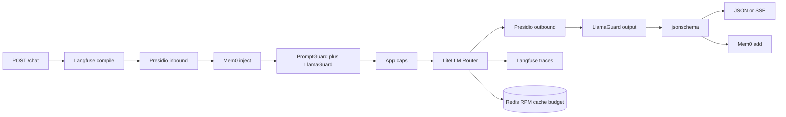

# Architecture

ReaLMM is a FastAPI gateway in front of LLM providers. Completions always go through LiteLLM’s Router in [`app/reliability.py`](../app/reliability.py). The Next.js console in [`web/`](../web/) is a client of `POST /chat`, not the product. It talks to uvicorn directly (CORS). It does not write `.env`, show keys, or toggle MEMORY / PII / GUARD.

Providers are inferred from non-empty `*_API_KEY` values in `.env` (LiteLLM, then [`app/llm.py`](../app/llm.py)). `GET /models` is that catalog. The client sends a catalog `model` on `POST /chat`. Groq is not required for chat. Groq-shaped **defaults** (guard classifier ids, FastEmbed because Groq has no embeddings API, strict JSON on some Groq models) are in [guardrails](guardrails.md), [memory](memory.md), and [structured](structured.md).

## Chat pipeline

JSON [`complete_chat`](../app/llm.py) and SSE [`stream_chat`](../app/llm.py) use the same order.

1. Named prompt compile ([`app/prompts.py`](../app/prompts.py)) when `prompt` is set
2. Presidio mask on compiled messages ([`app/pii.py`](../app/pii.py)) when `PII=1`
3. Mem0 search and inject ([`app/memory.py`](../app/memory.py)) when `MEMORY=1`
4. Presidio mask again on injected memory text when `PII=1`
5. Prompt Guard 2 and Llama Guard 4 inbound ([`app/guardrails.py`](../app/guardrails.py)) when `GUARD=1`
6. Token estimate and caps ([`app/budget.py`](../app/budget.py))
7. `router.acompletion` (retries, allowlisted fallbacks, cache TTL, RPM/TPM)
8. Presidio mask on the assistant reply when `PII=1`; Llama Guard 4 on outbound when `GUARD_CONTENT` is on; JSON Schema check when `response_format` is set; Langfuse OTEL callback on the Router when keys are set; record usage; Mem0 `add` in the background (extract errors do not fail the chat)

Always on: catalog from env keys ([`app/llm.py`](../app/llm.py)), Router, `MAX_OUTPUT_TOKENS`, usage ledger. Optional: Langfuse keys, `MEMORY=1`, `PII=1`, `GUARD=1`, `REDIS_URL`, per-request `response_format`. Unset optional layers leave `POST /chat` with `model` and `messages` unchanged.

## Modules

- [`app/main.py`](../app/main.py) — HTTP routes, SSE, health, CORS, gateway pointer
- [`web/`](../web/) — Next.js console (playground, read-only health lamps, copy `POST /chat`)
- [`app/schemas.py`](../app/schemas.py) — request and response models
- [`app/llm.py`](../app/llm.py) — provider detection, catalog, `complete_chat` / `stream_chat`
- [`app/reliability.py`](../app/reliability.py) — Router construction, fallbacks, cache, RPM/TPM
- [`app/prompts.py`](../app/prompts.py) — Langfuse / `prompts/*.json` and `langfuse_otel` callback
- [`app/budget.py`](../app/budget.py) — `token_counter`, `completion_cost`, daily ledger (Redis or JSON)
- [`app/memory.py`](../app/memory.py) — Mem0 sidecar and `RouterLLM`
- [`app/pii.py`](../app/pii.py) — optional Presidio mask in and out
- [`app/guardrails.py`](../app/guardrails.py) — optional Prompt Guard 2 and Llama Guard 4 via the Router
- [`app/structured.py`](../app/structured.py) — optional JSON Schema check after the Router

`data/` is gitignored. Budget writes `data/budget-state.json` when Redis is off. Mem0 uses `data/mem0/` (on-disk Qdrant + SQLite). [`compose.yaml`](../compose.yaml) is an optional operator run path (gateway + Next + Redis, `./data` volume). Pytest stays on the host venv. Do not put keys in images. The browser still calls `http://127.0.0.1:8000`, not the Compose hostname `gateway`.

## Ownership

The Router owns every completion: user chat and Mem0 fact extraction (`RouterLLM` in [`app/memory.py`](../app/memory.py)). Do not add a second path to providers.

- **Letta:** agent runtime. Memory tools fire inside Letta, not this Router.
- **PromptLayer `run()`:** bypasses the Router the same way.
- **LiteLLM Proxy spend DB / virtual keys:** a different product (Postgres gateway). This app calls `router.acompletion`.
- **Mem0:** `search` / `add` only. Default unconfigured Mem0 is OpenAI plus `/tmp` Qdrant; this app does not use that stack.
- **Presidio:** text rewrite around the Router. Not LiteLLM Proxy guardrails.
- **Prompt Guard 2 / Llama Guard 4:** extra Router `acompletion` calls that block, they do not replace chat.
- **`response_format` / jsonschema:** pass-through plus in-process validate. Not Instructor reask, not local logit grammars.
- **LangChain memory, Zep, homemade JSON summaries:** wrong primitive or a harness this gateway would have to keep.

`GET` / `POST` / `DELETE /memory` is the HTTP hook for later MCP / A2A clients. Those protocols are not implemented here.

Knobs and failure modes live in [reliability](reliability.md), [prompts](prompts.md), [budget](budget.md), [memory](memory.md), [pii](pii.md), [guardrails](guardrails.md), and [structured](structured.md). Env examples are in [`.env.example`](../.env.example).
