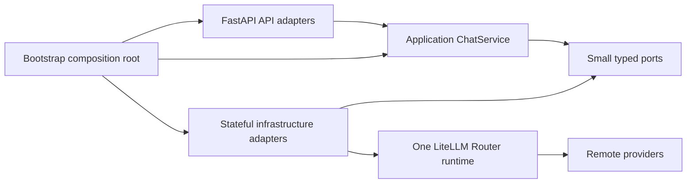
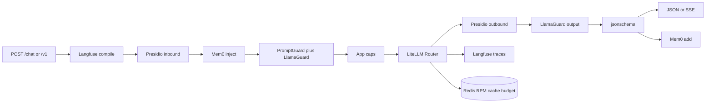

# Architecture

One FastAPI process, one `ChatService` pipeline, one LiteLLM Router. User chat, guard classifiers, and Mem0 fact extraction all call [`LiteLLMRouterRuntime`](../app/infrastructure/router.py) (`router.acompletion`).

The Next.js console in [`web/`](../web/) talks to uvicorn over CORS. It does not write provider keys. Inbound auth is fail-closed unless loopback development explicitly sets [`GATEWAY_ALLOW_OPEN=1`](auth.md). OpenAI SDKs use [`POST /v1/chat/completions`](openai.md). Native clients use `POST /chat`.

Providers come from non-empty `*_API_KEY` values in `.env` (LiteLLM, then [`ProviderCatalog`](../app/infrastructure/catalog.py)). `GET /models` is that catalog. You send a catalog `model` on `POST /chat`. Groq is optional for chat. Ollama is another keyed provider: a dummy `OLLAMA_API_KEY` plus optional `OLLAMA_API_BASE` (default `http://127.0.0.1:11434`). Guard classifier ids, FastEmbed, and Groq strict JSON defaults are documented in [guardrails](guardrails.md), [memory](memory.md), and [structured](structured.md).

[`bootstrap.py`](../app/bootstrap.py) is the composition root: dotenv, `GatewaySettings`, `build_runtime()`, `create_app(runtime)`. [`app/main.py`](../app/main.py) is `app = create_configured_app()` for `uvicorn app.main:app`.

## Chat pipeline

JSON `ChatService.complete` and SSE `ChatService.stream` use the same order. Native `/chat` and OpenAI `/v1/chat/completions` are encoders over those methods.

1. Named prompt compile ([`PromptRepository`](../app/infrastructure/prompts.py)) when `prompt` is set
2. One immutable [`RuntimeFlags`](../app/application/models.py) snapshot for the whole request
3. Presidio mask on compiled messages ([`PiiRuntime`](../app/infrastructure/pii.py)) when PII is on
4. Mem0 search and inject ([`MemoryRuntime`](../app/infrastructure/memory.py)) when MEMORY is on (no-op when off)
5. Presidio mask again on injected memory text when PII is on
6. Prompt Guard 2 and Llama Guard 4 inbound ([`GuardService`](../app/infrastructure/guards.py)) when GUARD is on
7. Resolve catalog model, token estimate, and caps ([`BudgetRuntime`](../app/infrastructure/budget.py)). Process daily caps plus the calling key's quotas and RPM.
8. Sole `router.acompletion` (retries, allowlisted fallbacks, cache TTL, RPM/TPM)
9. Presidio on the assistant reply when PII is on.
10. Llama Guard 4 outbound when `GUARD_CONTENT` is on.
11. JSON Schema check when `response_format` is set.
12. Langfuse OTEL callback on the Router when keys are set.
13. Record usage (process ledger and, when a key is bound, that identity's counters).
14. Mem0 `add` in the background (extract errors do not fail the chat).

Always on:

- catalog from env keys
- Router
- `MAX_OUTPUT_TOKENS`
- usage ledger

Configured as needed:

- `GATEWAY_API_KEY` (required unless loopback development explicitly allows open startup)
- Langfuse keys
- `MEMORY=1`
- `PII=1`
- `GUARD=1`
- `REDIS_URL`
- per-request `response_format`

When optional layers are unset, `POST /chat` and `/v1/chat/completions` keep the same `model` and `messages` behavior.

MEMORY / PII / GUARD can also be flipped at runtime via `PATCH /config` into `data/runtime-flags.json` when a gateway key is configured. That overlay does not mutate `os.environ`.

## Configuration

1. [`bootstrap.load_dotenv_once`](../app/bootstrap.py) loads `.env` once with `override=False`. Process and Compose env win.
2. [`GatewaySettings`](../app/settings.py) validates ReaLMM-owned static knobs. Provider `*_API_KEY` values stay in `os.environ` for LiteLLM autodetection. They are not settings fields.
3. [`RuntimeFlagStore`](../app/infrastructure/flags.py) overlays only `MEMORY`, `PII`, `GUARD`, `GUARD_INJECTION`, and `GUARD_CONTENT` from `data/runtime-flags.json`.
4. Each request reads an immutable snapshot. `PATCH /config` writes the JSON file atomically (tmp + replace).

Malformed `DAILY_USD_BUDGET`, `DAILY_TOKEN_BUDGET`, `MAX_OUTPUT_TOKENS`, or `MEMORY_EMBEDDER` fail startup. Empty optional budgets stay unset. `LITELLM_NUM_RETRIES`, cache TTL, and RPM fall back silently when malformed. `FALLBACKS` unset means same-provider; empty / `off` means retry-only.

## Modules

API adapters: [`app/api/`](../app/api/) (factory, auth, error mapping, native/OpenAI encoders, route modules). HTTP DTOs live in [`app/schemas.py`](../app/schemas.py).

Application: [`ChatService`](../app/application/chat.py) and [ports](../app/application/ports.py). No FastAPI, LiteLLM, Mem0, Presidio, or Redis imports.

Infrastructure: [catalog](../app/infrastructure/catalog.py), [Router](../app/infrastructure/router.py) (sole `litellm.Router` and `litellm.cache` owner), [prompts](../app/infrastructure/prompts.py), [budget](../app/infrastructure/budget.py), [memory](../app/infrastructure/memory.py), [PII](../app/infrastructure/pii.py), [guards](../app/infrastructure/guards.py), [flags](../app/infrastructure/flags.py). JSON Schema check after the Router is [`app/structured.py`](../app/structured.py).

Runtime owner: [`app/container.py`](../app/container.py) (`GatewayRuntime` start/close).

`data/` is gitignored. Budget writes `data/budget-state.json` when Redis is off. Mem0 uses `data/mem0/` (on-disk Qdrant + SQLite). [`compose.yaml`](../compose.yaml) runs gateway + Next + Redis with a `./data` volume. Pytest stays on the host venv. Do not put keys in images. The browser still calls `http://127.0.0.1:8000`, not the Compose hostname `gateway`.

