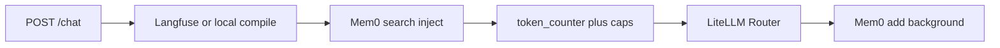

# Architecture

ReaLMM is a FastAPI gateway in front of LLM providers. Completions always go through LiteLLM’s Router in [`app/reliability.py`](../app/reliability.py). The page in [`app/static/index.html`](../app/static/index.html) is a client of `POST /chat`, not the product.

Providers are inferred from `*_API_KEY` in `.env`. The client picks a model from `GET /models`.

## Chat pipeline

JSON [`complete_chat`](../app/llm.py) and SSE [`stream_chat`](../app/llm.py) use the same order.

1. Named prompt compile ([`app/prompts.py`](../app/prompts.py)) when `prompt` is set
2. Mem0 search and inject ([`app/memory.py`](../app/memory.py)) when `MEMORY=1`
3. Token estimate and caps ([`app/budget.py`](../app/budget.py))
4. `router.acompletion` (retries, fallbacks, cache, RPM)
5. Record usage; Mem0 `add` in the background (extract errors do not fail the chat)

Always on: catalog from env keys ([`app/llm.py`](../app/llm.py)), Router, `MAX_OUTPUT_TOKENS`, usage ledger. Optional: Langfuse keys, `MEMORY=1`. Unset optional layers leave `POST /chat` with `model` and `messages` unchanged.

## Modules

- [`app/main.py`](../app/main.py) — HTTP routes, SSE, health
- [`app/schemas.py`](../app/schemas.py) — request and response models
- [`app/llm.py`](../app/llm.py) — provider detection, catalog, `complete_chat` / `stream_chat`
- [`app/reliability.py`](../app/reliability.py) — Router construction
- [`app/prompts.py`](../app/prompts.py) — Langfuse / `prompts/*.json`
- [`app/budget.py`](../app/budget.py) — `token_counter`, `completion_cost`, daily ledger
- [`app/memory.py`](../app/memory.py) — Mem0 sidecar and `RouterLLM`

`data/` is gitignored. Budget writes `data/budget-state.json`. Mem0 uses `data/mem0/` (on-disk Qdrant + SQLite).

## Ownership

The Router owns every completion: user chat and Mem0 fact extraction (`RouterLLM` in [`app/memory.py`](../app/memory.py)). Do not add a second path to providers.

- **Letta:** agent runtime. Memory tools fire inside Letta, not this Router.
- **PromptLayer `run()`:** bypasses the Router the same way.
- **LiteLLM Proxy spend DB / virtual keys:** a different product (Postgres gateway). This app calls `router.acompletion`.
- **Mem0:** `search` / `add` only. Default unconfigured Mem0 is OpenAI plus `/tmp` Qdrant; this app does not use that stack.
- **LangChain memory, Zep, homemade JSON summaries:** wrong primitive or a harness this gateway would have to keep.

`GET` / `POST` / `DELETE /memory` is the HTTP hook for later MCP / A2A clients. Those protocols are not implemented here.

Langfuse is prompt management only. Tracing is out of scope.

Knobs and failure modes live in [reliability](reliability.md), [prompts](prompts.md), [budget](budget.md), and [memory](memory.md). Env examples are in [`.env.example`](../.env.example).
