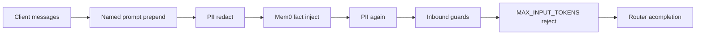
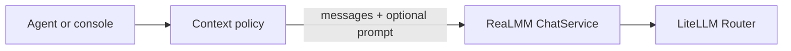

# Context engineering vs this gateway

**Context engineering** is choosing *what tokens the model sees*: instructions, retrieved facts, tools, and which history survives the window. ReaLMM is a **completion gateway**. It can *decorate* a client-supplied window. It does not *own* or *compact* that window.

## What already happens

Each `POST /chat` must send the full `messages` list. The console (`useChatSession`) appends the new user turn and posts the whole array. The gateway never reloads a transcript by `conversation_id`.

[`ChatService._prepare_outgoing`](app/application/chat.py) then builds Router `messages` in this order:

| Lever | What it is | What it is not |
| --- | --- | --- |
| `messages` | Hot window from the client | Server-side chat log |
| `prompt` + `variables` | Langfuse/local compile, **prepended** | Dynamic instruction routing |
| Mem0 (`MEMORY=1`) | Search facts → one `"Relevant memory:"` system block; write last user+assistant in the background | Transcript replay, RAG over files |
| `user_id` / `conversation_id` / `agent_id` | Mem0 scope + Langfuse session/tags | History fetch key |
| `MAX_INPUT_TOKENS` | Hard **400** if the estimate is too big | Trim / summarize / drop old turns |
| PII / Guard | Rewrite or **block** | Context selection |

So: **partial support** for “assemble context before the model,” not a context-engineering product.

## What is missing (on purpose)

These five are not backlog for ChatService. **Add nothing in this gateway.** Do them in the process that already owns `messages`.

| Gap | What it is | Why not here | Who does it |
| --- | --- | --- | --- |
| **Sliding window / token packing** | Drop or pack old turns so the prompt fits | Client already sends the full list ([`useChatSession`](web/hooks/useChatSession.ts)). Gateway mutating that list fights the contract. [`MAX_INPUT_TOKENS`](docs/budget.md) already **rejects** (400); it does not trim. | Console/agent: keep last N turns or last M tokens, then POST |
| **Compaction** | Summarize old turns into a system note | Extra completion (second path or recurse into `/chat`). Homemade JSON summaries are already a documented non-goal. | Agent/Letta in front of `/v1`; then send the compacted `messages` |
| **Document RAG** | Chunk files, retrieve, inject | Separate product (ingest + index). See RAG stance: Mem0 is facts only. | Standalone LlamaIndex/LangChain; chunks go in `messages` |
| **Tool-call / tool-result plumbing** | `tools` on the request; `tool` / `tool_calls` roles in the transcript | **Execution** and the tool loop are an agent. Today [`OpenAIChatRequest`](app/schemas.py) `extra="ignore"` and [`ChatMessage`](app/schemas.py) only allow system/user/assistant strings; [`docs/openai.md`](docs/openai.md) drops `tools`. | Agent runs tools and posts results. Optional *later* in this repo: **passthrough** of `tools` JSON to the Router (wire format only — not this gap as a context engine) |
| **Server-side session store** | Reload transcript by `conversation_id` | `conversation_id` is Mem0 `run_id` + Langfuse `session_id`, **not** a history fetch key. A store here makes the gateway the chat log (Letta-shaped) and duplicates the client window. | Client state (console already holds `messages`); or an agent DB |

[`docs/architecture.md`](docs/architecture.md) already treats Letta, LangChain memory, and homemade JSON summaries as the wrong primitive *inside this process*. Those are context-engineering runtimes that would either recurse into `POST /chat` or bypass the Router.

## Should this gateway grow another layer?

**No — not as a new in-process “context engine” that calls the model again.** That would duplicate ChatService, skip the single-Router rule, and fight the client-owned window.

Put context engineering **in front of** ReaLMM:

- **Console / your agent** decides the window (drop old turns, keep last N, attach files).
- **This gateway** keeps: named prompts, Mem0 facts, PII, guards, caps, one Router.
- **Letta / an agent runtime** (separate process) if you need tools, long-running memory, and compaction. Point it at `/v1` with `GATEWAY_API_KEY`; do not point Mem0’s extract LLM at `POST /chat`.

If you later want *light* help on the gateway, the only fit that stays in-layer is **fail-closed input policy already there** (`MAX_INPUT_TOKENS`) or a documented client helper. Do not add automatic trim/summarize inside `ChatService` unless you explicitly want the gateway to mutate the client’s transcript.

## Bottom line

**Add nothing** for those five. The gateway already decorates (prompt + Mem0 facts + PII + guards + cap). It does not own the window, compact it, RAG files, run tools, or store sessions.

The sole later exception that is still gateway-shaped (from the tools stance, not this list) is forwarding `tools` JSON on `/v1` without executing them. That is wire format. It is not sliding window, compaction, RAG, or a session store.
