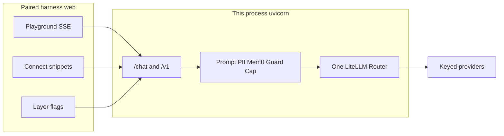

# Completeness: wrapping + harness

**Decision: you are done.** This repo already is a complete LLM-wrapping gateway with a ready paired harness. Do not add another product layer. Optional polish exists; none of it is required to call the wrapping complete.

## What “complete wrapping” means here

A wrapper is complete when a client can pick a catalog model, send `messages`, and get a completion that always goes through one reliability path, with optional sidecars that do not steal that path. It is **not** complete only when it matches full OpenAI, an agent IDE, or every RAG framework.

This repo already closes that loop:

- **Ingress:** native [`POST /chat`](app/api/routes/chat.py) and OpenAI [`POST /v1/chat/completions`](app/api/routes/openai.py) over the same [`ChatService`](app/application/chat.py).
- **Catalog:** providers from `*_API_KEY`; client picks `model` ([`docs/architecture.md`](docs/architecture.md)).
- **One Router:** retries, fallbacks, cache, RPM/TPM ([`docs/reliability.md`](docs/reliability.md), ADR [0002](docs/adr/0002-single-router-owner.md)).
- **Decoration, not a second brain:** named prompts, Presidio, Mem0 facts, Prompt/Llama Guard, caps, jsonschema check. Unset layers leave `model` + `messages` unchanged.
- **Operator controls:** `GATEWAY_API_KEY`, `PATCH /config` overlay, Compose + Redis, CI (Python 3.14 + Node 22).
- **Paired harness:** Next console talks to `:8000` directly — Playground stream, catalog lamps, Settings flags, Connect curl/Python/`/v1` snippets. No provider keys in the browser.

There are no `TODO`/`FIXME` markers in `app/`. Feature docs each say what they are **and** what not to stack. That is a closed product, not an unfinished platform.

## What the harness already is

[`web/`](web/) is an operator playground, not an agent. That is the correct pairing:

- Connect, paste gateway key (sessionStorage), pick model, stream `/chat`, New chat aborts and rotates `conversation_id`.
- Settings toggles MEMORY / PII / GUARD when a gateway key is configured.
- Connect copy-paste: curl, httpx, OpenAI Python SDK against `/v1`.

It does not need file RAG, tool loops, or a server transcript store to be “ready.” Refresh-clears-bubbles is documented ([`docs/memory.md`](docs/memory.md)): Mem0 stores facts, not a replayable log.

## Do not add (already decided)

These would make the wrapping *less* complete by blurring the product:

- Context engine (sliding window, compaction, server session store)
- Document RAG / LlamaIndex / LangChain retrievers
- MCP / A2A as personalities of this binary
- Tool **execution** / agent loop
- Letta, LiteLLM Proxy, Instructor reask, Outlines/Guidance
- `/v1/embeddings`, `/v1/moderations`, `/v1/completions` (documented absences)
- Inbound SlowAPI limiter (deferred on purpose; Router RPM owns quota)

If a user needs those, they sit **in front of** `/v1` (or use `/memory` over HTTP). The wrapper stays a wrapper.

## What is left (none of it is “must add”)

**“Later” is not a backlog for this repo.** Optional polish *may* be added if a real caller needs it. Agent/RAG/MCP/context-engine items are **not** later work here — they stay other processes.

### Housekeeping (not product)

- Gitignore [`future stuff/`](future%20stuff/) so stance notes are not committed by accident. They are planning artifacts, not runtime.

### Later optional, still in-layer (only if a real need appears)

Not scheduled. Not required. Gateway wire / harness UX only:

- `/v1` **`tools` JSON passthrough** (no execution)
- Forward `temperature` / `top_p` / `stop` under `MAX_OUTPUT_TOKENS`
- Native SSE `[DONE]` after mid-stream error
- Console Stop button, last-N trim, JS snippet, abort bubble cleanup

### Never later in this repo

Context engine, document RAG, LlamaIndex/LangChain, MCP/A2A personalities, tool execution, Letta, LiteLLM Proxy, Instructor, session store.

### Never required to call it done

Full OpenAI surface, multimodal `content` arrays, request-id middleware, idempotency keys, markdown renderer, persisted playground transcripts, `/ready` probes, inbound HTTP rate limits.

Subset OpenAI is **intentional**: extra params are ignored and tested ([`docs/openai.md`](docs/openai.md)). A wrapping gateway can be complete while remaining a documented subset.

## Bottom line

**Stop growing this codebase as a product.** It already wraps LLMs (one Router, optional sidecars, native + `/v1`) and ships a paired harness (console + snippets + Compose).

Use it. Point agents at `/v1`. Keep RAG, tools loops, MCP, and window policy outside. If you ever touch the repo again, pick one optional polish item — do not open a new layer.
