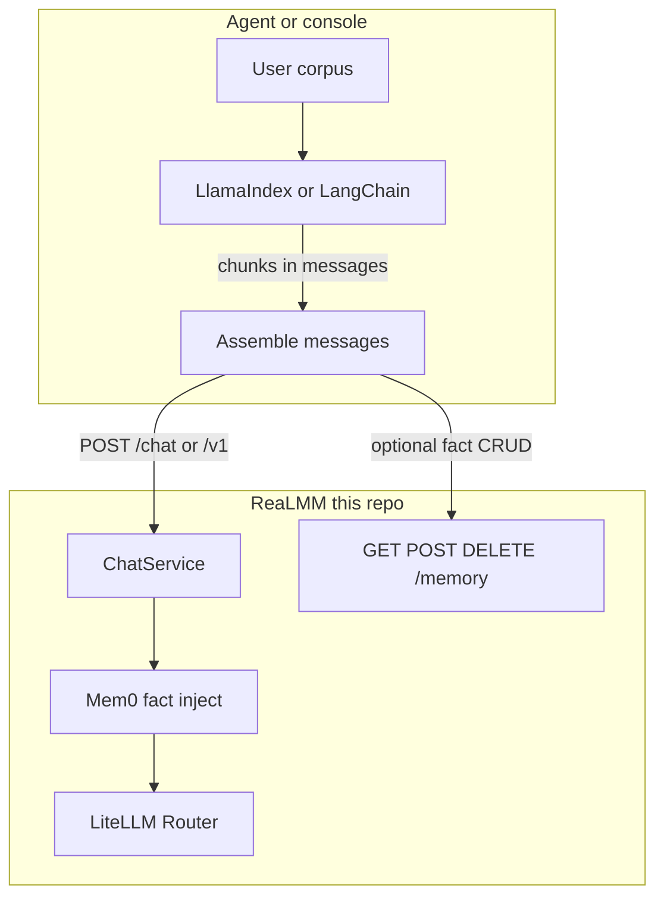

# Retrieval and RAG: analysis and decision

**Decision: add nothing to this gateway.** Memory already works (Mem0). Document RAG belongs in a standalone process. Do not add LlamaIndex, LangChain, ingest APIs, a second Qdrant collection, or retriever flags.

- **Memory (facts about the user / session):** keep the existing Mem0 sidecar. Do not replace it with LangChain memory, LlamaIndex memory, or a second vector collection in ChatService.
- **User document RAG (PDFs, wikis, code, the user’s own corpus):** standalone. LlamaIndex, LangChain retrievers, or any other index lives in front of ReaLMM. The client retrieves, then POSTs `messages` (with chunks already in the window) to `/chat` or `/v1`. This gateway does not ingest files, chunk, hybrid-search a knowledge base, or synthesize a RAG answer.

They are complementary in an industry stack (Mem0 even documents this: RAG over documents is static knowledge; Mem0 is extracted, scoped, updating facts). They are not two optional retriever backends on `uvicorn app.main:app`.

## What ReaLMM already retrieves

[`MemoryRuntime`](app/infrastructure/memory.py) is already a retriever — for **extracted facts**, not documents.

On each chat, [`ChatService._prepare_outgoing`](app/application/chat.py) does: named prompt → PII → Mem0 `search` on the last user turn (`top_k=5`, scoped by `user_id` / `agent_id`) → prepend one `"Relevant memory:"` system block → PII again → guards → `MAX_INPUT_TOKENS` reject → Router. After the reply, Mem0 `add` runs in the background (RouterLLM extract, tagged `mem0-extract`).

HTTP pairing already exists: [`GET/POST/DELETE /memory`](app/api/routes/memory.py). Store is on-disk Qdrant collection `realmm` plus SQLite history under `data/mem0/`. Embedder is FastEmbed `bge-small-en-v1.5` (or OpenAI). [`docs/memory.md`](docs/memory.md) states this is not Letta, Zep, LangChain memory, or a homemade transcript.

So: **partial retrieval support**, for memory only. Document RAG is listed as missing **on purpose** in the context-engineering stance.

## Two different products (do not collapse them)

| | Mem0 in this gateway | LlamaIndex / LangChain RAG |
| --- | --- | --- |
| Unit of storage | Deduped **facts** extracted from turns (`infer` on) | **Chunks / nodes** from files |
| Write path | LLM extract + conflict resolution | Parse → split → embed → upsert (IngestionPipeline / loaders) |
| Read path | Semantic search of facts, inject system block | Retriever returns Documents/Nodes; often then an LLM **synthesizes** |
| Lifecycle | Per `user_id` / `run_id` / `agent_id`, updates as chat happens | Offline or async ingest; query servers stay stateless |
| Who owns the corpus | The conversation | The user’s files / knowledge base |
| LLM calls | Extract (sidecar, already through the Router) | Query rewrite, rerank, **and** answer synthesis in QueryEngine / RetrievalQA |

Mem0’s own architecture comparison: raw vector DB has no extract/dedup; chat history is not long-term; **RAG over documents has no personalization and does not update memory**. Production write-ups (Mem0 + Qdrant + LangGraph) use a **dual-brain**: Mem0 for people facts, a **separate** Qdrant/index for manuals. ReaLMM already has brain one. Brain two must not share collection `realmm` or ChatService.

## What LlamaIndex and LangChain actually are

**LlamaIndex** is a data/RAG framework, not a drop-in MemoryPort.

- **IngestionPipeline**: transformations (split, embed, metadata) → vector store. Production rule: do not rebuild the index inside an API handler.
- **Retriever**: returns `NodeWithScore` (lookup only).
- **RetrieverQueryEngine**: retrieve + **response synthesizer** (`refine` / `compact` / `tree_summarize` / …). `synthesize` is another completion.
- Default `index.as_query_engine()` is a RAG **product**: ingest policy, chunk size, postprocessors, citations, a second LLM.

Putting that in ChatService either (a) calls the model twice (QueryEngine then Router, or QueryEngine bypassing the Router), or (b) still forces this process to own file upload, collections, and embedder identity.

**LangChain retrievers** are `BaseRetriever`: query in, `Document` list out. That interface looks small. The ecosystem around it is not.

- **VectorStoreRetriever**: pure similarity / MMR. Still needs a populated store, embedding model, and ingest.
- **MultiQueryRetriever / SelfQueryRetriever / ContextualCompression**: **call an LLM** (paraphrase, metadata filters, compress). That is a second path to providers unless wired through `CompletionBackend` — and then ChatService is running an agent-shaped retrieve loop.
- **RetrievalQA / `create_retrieval_chain`**: retriever + prompt + LLM. Official pattern is `retriever | prompt | llm`. That **is** the completion. It would skip or duplicate [`LiteLLMRouterRuntime`](app/infrastructure/router.py).

ADR [0001](docs/adr/0001-modular-monolith.md): no plugin registry. ADR [0002](docs/adr/0002-single-router-owner.md): no second path to providers. LangChain/LlamaIndex are plugin ecosystems whose happy path is “our LLM client.”

LangChain **memory** (buffer, summary, entity) is a different wrong primitive: transcript replay / homemade summaries. Already rejected in [`docs/architecture.md`](docs/architecture.md) and [`docs/memory.md`](docs/memory.md).

## Why “optional LlamaIndex or LangChain in the gateway” is a bad product

1. **Ingest is not a chat sidecar.** Document RAG needs loaders, chunkers, hash/dedup, collection names, re-embed when the model changes, file size limits, and a job that is not `POST /chat`. Mem0’s write is “extract this turn.” Those pipelines do not share a flag.

2. **QueryEngine / RetrievalQA steal the Router.** Synthesis inside LlamaIndex or a LangChain chain is a second completion path (retries, fallbacks, cache, RPM, Langfuse, budget skipped — or recursive if the chain’s LLM is `POST /chat`).

3. **A “retriever-only” option still explodes scope.** Even if ChatService only injected chunks (mirroring Mem0’s system block), this binary would own: upload API, per-user collections, embedder dims vs Mem0’s 384/1536, hybrid/BM25, rerank, citations, and a new `MAX_INPUT_TOKENS` fight when k chunks blow the cap. The console would become a knowledge-base app.

4. **Collection collision.** Mem0 already uses Qdrant at `data/mem0/qdrant`, collection `realmm`. Document nodes in that store mix facts with chunks, break Mem0 filters, and force a re-index if dims change. A second on-disk Qdrant in-process is a second product pretending to be a flag.

5. **PII / guards / cap already work if RAG is in front.** Chunks in `messages` already hit Presidio, then Mem0, then guards, then the input cap. Moving retrieve inside the gateway means scanning retrieved text, counting it, and deciding fail-closed vs trim — which is context engineering, already rejected.

6. **Compatibility theater.** Callers who already have LlamaIndex do not need this app to import `llama_index`. Callers who want LangChain retrievers already compose them in LCEL. Adding both as options means maintaining two frameworks so every caller still uses one.

## What would actually fit

Keep ReaLMM a **completion + fact-memory sidecar**.

**Memory (this repo, already done)**

- Leave Mem0 as the only in-process retrieval.
- Use `/memory` from a standalone agent or later MCP adapter; do not add a LangChain retriever wrapper over the same Qdrant.
- Do not point Mem0 extract at `POST /chat` (recursion). Extract already uses `RouterLLM` → `CompletionBackend`.

**User RAG (standalone process)**

- Ingest and retrieve with LlamaIndex **or** LangChain **or** a raw vector DB — user’s choice, out of this repo.
- Put retrieved text into `messages` (system or user). Then one `POST /chat` / `/v1`.
- If they use a QueryEngine, its **synthesis LLM** should be ReaLMM `/v1` (so budget, PII, Mem0 facts, guards still apply). Prefer retrieve-then-POST so this gateway sees a normal chat window.
- Do not add LiteLLM Proxy “vector store / RAG” features; that is a different product, already a non-goal.

**Later, if you want anything inside the gateway (still gateway-shaped)**

- Document for clients: “RAG chunks go in `messages`; Mem0 is extra.”
- Do **not** add `llama-index` / `langchain` to [`requirements.txt`](requirements.txt).
- Do **not** add `/ingest`, `/query`, or a second MemoryPort implementation.
- The only in-layer stretch that would still be decoration (not a RAG product) would be a client-supplied extra string prepend, like named prompts. That is optional and not required; the client can already put that string in `messages`.

## Bottom line

**Add nothing.** No new dependency, route, flag, or ChatService step.

- **Memory retrieval** = already here (Mem0). Leave it.
- **User document RAG** = standalone. Retrieve there; complete here.
- **LlamaIndex / LangChain** = not in `requirements.txt`, not in this process.
